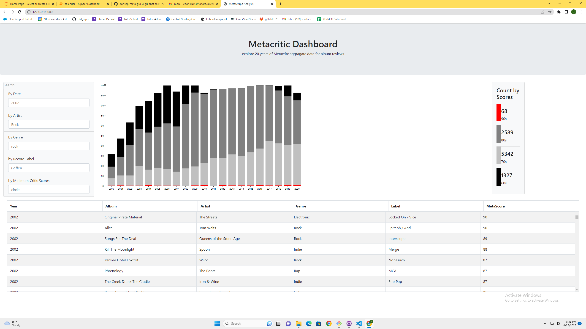

# meta_dashboard - A web application and server for analyzing the past twenty years of music reviews on metacritic.
## A dynamic dashboard that allows users to filter a table, barchart and KPIs by album name, artist, record labl, genres, year and scores
### Technologies
- Web Server - Flask
- visulzations - Plotly
- Table - DataTables - jquery plugin
- Database - sqlite

---

